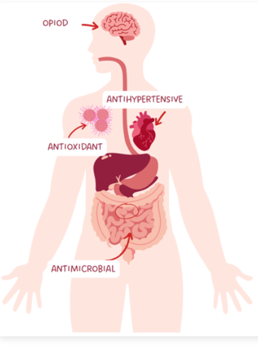
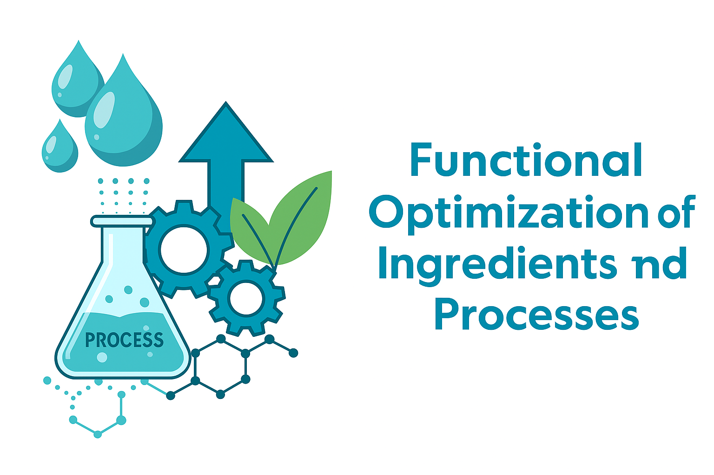
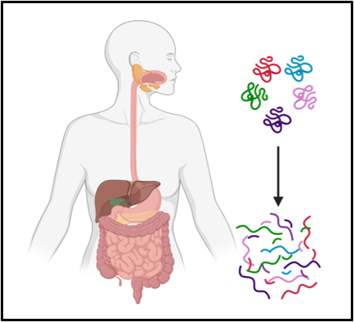
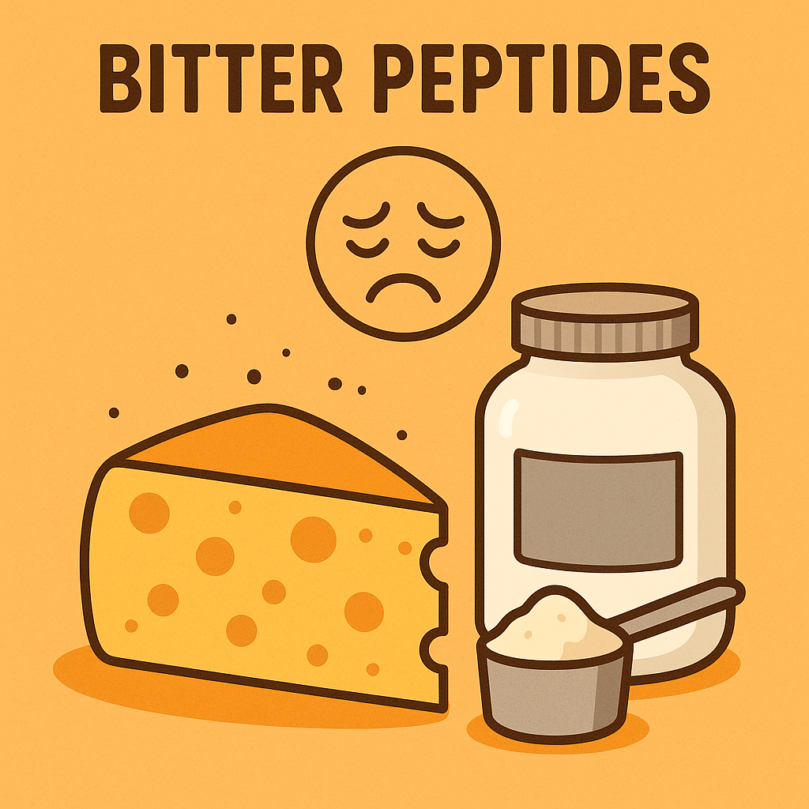
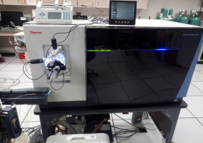
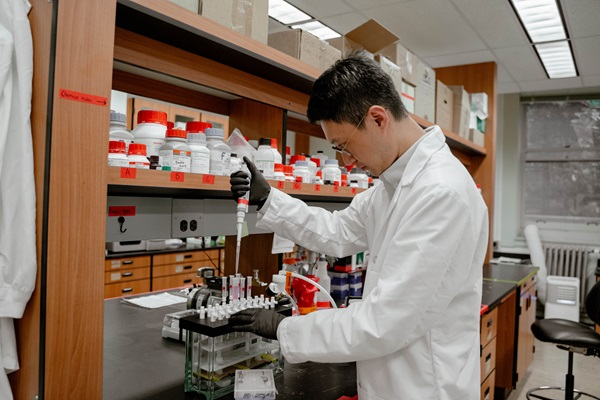
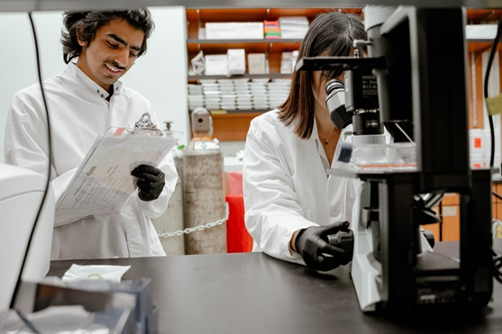
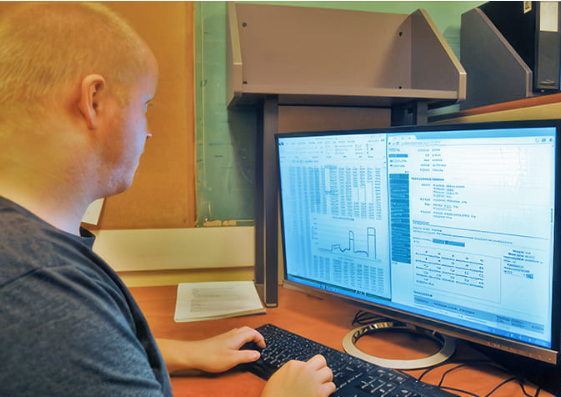
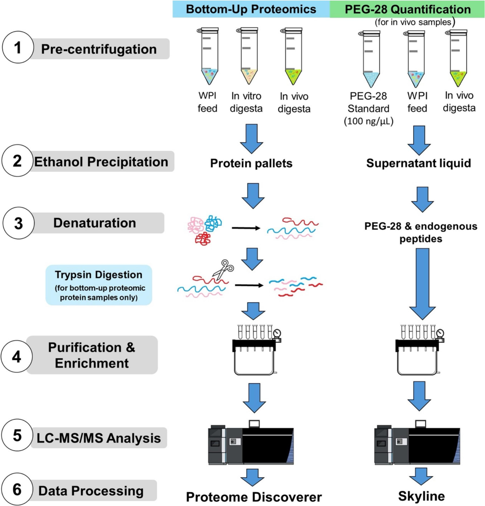

# The Dallas Lab @ Oregon State University

---

## 🧪 Research

### Milk Bioactive Peptides

Our research is at the forefront of the field in identification and characterization of bioactive peptides in milk and dairy products, with a focus on their functional properties and potential health benefits.

**Research highlights:**
- Curate the Milk Bioactive Peptide Database (https://mbpdb.nws.oregonstate.edu/)
- Novel peptide discovery
- Functional characterization
- Protein-peptide binding simulations
- Functional Annotation of peptidomic data
- Learn More (expanded content will be added at a later data)

---

### Functional Optimization of Ingredients and Processes

Our research focuses on optimizing dairy processing methods to enhance bioactive protein preservation and functionality. We investigate various processing parameters and their effects on the retention of intact proteins and nutritional compounds.

**Key areas include:**
- Heat treatment optimization
- UV and HPP Pasteurization techniques
- Spray drying process development
- Bitterness mitigation
- Novel processing technologies
- Learn More (expanded content will be added at a later data)

---

### Protein Digestion and Absorption

Our research examines the digestive path of milk proteins and peptides, from initial digestion to absorption and potential systemic effects.

**Key investigations:**
- In vitro digestion modeling
- Peptide release across digestion
- Survivability of intact proteins across digestion
- Absorption of peptides from  digestion into blood
- Learn More (expanded content will be added at a later data)

---

### Human Nutrition and Digestion

Our research explores the unique aspects of infant digestion and nutrition, with a focus on milk bioactivity and its role in infant development.

**Key areas:**
- Formula development
- Comparison of Human Milk vs Infant Formula
- Infant digestion modeling
- Preterm infant nutrition
- Growth and development
- Learn More (expanded content will be added at a later data)

---

### Bitter Peptides in Dairy Products

We study of bitter peptides in dairy product s through sensory analysis coupled with mass spectrometry working to  mitigate bitterness in products such as aged cheese and whey protein hydrolysate.

**Research focus:**
- LC-MS/MS bitter peptide identification
- Formation mechanisms
- Peptides link to microbial cultures
- Mitigation strategies
- Sensory guided fractionation
- Learn More (expanded content will be added at a later data)

---

## 🧰 Services

### Protein Analysis

The Dallas lab specializes in comprehensive protein analysis using  advanced mass spectrometry techniques  to characterize proteins in biological   materials such as milk, blood, and digesta and various dairy products.

**Services:**
- Bottom-up proteomics​
- Top-down proteomics
- Label-free quantitation
- TMT-labeling quantitation​
- MRM- and PRM-based absolute quantitation​
- PTM-specific analysis (Phosphorylation & N- and O-Glycosylation)​
- ELISA & Gel electrophoresis​
- Custom protein analysis protocols

Not sure what you need for your project? Feeling lost with all the jargon?  Reach out to us we will work with you to determine the best analysis for you project

- [Learn More](services_protein_peptide_page.md)

---

### Peptidomic Analysis

Partner with us for advanced peptide analysis to characterize bioactive peptides in products, including their functional properties and digestion products.

**Services:**
- Comprehensive Peptidomics using LC-MS and MS/MS​
- Functional Annotation​
- Absorptomics ​ (absorption of peptides into the blood)
- Bioactive peptide discovery​
- Custom peptide analysis protocols

Not sure what you need for your project? Feeling lost with all the jargon? Reach out to us we will work with you to determine the best analysis for you project

- [Learn More](services_protein_peptide_page.md)

---

### Functional Analysis

We offer a suite of functional assays to evaluate the biological activity of milk and dairy components. Our team specializes in cell-based and biochemical assays to assess immunomodulatory, enzymatic, and metabolic effects, supporting both research and product development.

**Services:**
- Cell adhesion assays
- THP-1-derived macrophage immunomodulatory assays
- Enzyme assays (BSSL, lipases, proteases, lysozyme)
- Lipid oxidation testing
- Fatty acid profiling
- Fecal fat and protein analysis

- [Learn More](services_functional_page.md)

---

### In Vitro Digestion

Our lab provides has the unique ability to offer advanced in vitro digestion modeling using both static and dynamic systems. These models simulate human gastrointestinal conditions to study the digestion and bioavailability of milk proteins, peptides, and other nutrients, including the impact on the gut microbiome.

**Services:**
- Survivability of protein through the course of digestion
- Bioactive peptide release during digestion
- Static in vitro digestion with INFOGEST protocol
- SHIME digestion without microbiome analysis
- SHIME with microbiome analysis
- Custom model development

- [Learn More](services_digestion_page.md)

---

### Scoping Review Articles

Whether you need comprehensive literature reviews for regulatory submissions or seek an experienced academic partner for scientific publications, our team delivers rigorous, high-quality scientific writing tailored to your specific requirements. We specialize in synthesizing complex research data into clear, compelling documents that meet both regulatory standards and academic excellence.

**Services:**
- Technical Reports
- Scientific Publications
- Systematic Review
- Custom review projects available

- [Learn More](services_writing_page.md)

---

### Method Development

Dairy presents unique analytical challenges due to its complex matrix. Our specialized team develops tailored mass spectrometry methods to overcome these obstacles, enabling precise identification and quantification of bioactive peptides, milk proteins, and their modifications. Whether you're investigating dairy processing effects, nutritional biomarkers, or functional peptides in milk systems, we collaborate with researchers to design robust analytical workflows that deliver reliable, reproducible results for your specific milk analysis needs.

**Services:**
- Advanced sample preparation techniques
- LC-MS/MS method development and optimization
- Consulting

- [Learn More](services_method_dev_page.md)

---

## 👥 About Us

The Dallas Lab at Oregon State University is dedicated to unraveling the biological secrets of human and bovine milk. Our multidisciplinary team investigates how milk's proteins and peptides are affected by digestion and how these components support infant and adult health. We are passionate about developing innovative processing methods that preserve milk's bioactivity, with the goal of improving nutrition and health outcomes for all ages.

