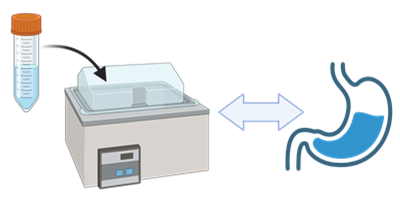
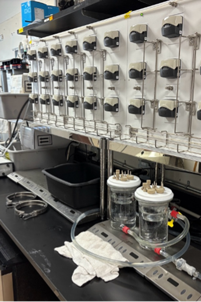
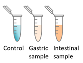

# Understanding In Vitro Digestion: Your Questions Answered

## What We Do

**Q: What is in vitro digestion and why is it crucial for understanding my products?**

A: In vitro digestion is laboratory-based simulation of what happens to your products inside the human digestive system - without needing human or animal testing. We recreate the stomach, small intestine, and large intestine conditions using the same acids, enzymes, and salts found in the human body. This allows us to "look inside the black box" of digestion and understand exactly how your proteins break down, which nutrients are released, and what bioactive compounds become available for absorption.

**Q: Why can't I just rely on the nutritional composition of my raw ingredients?**

A: What's in your product before digestion is very different from what's actually available to the body after digestion. Proteins may break down into beneficial peptides, some nutrients may become more bioavailable, while others might be destroyed or bound up. Processing conditions like pasteurization, fermentation, or drying can dramatically change how your product behaves during digestion.

## Our Specialized Capabilities

**Q: What makes your in vitro digestion services unique?**

A: We're one of the few laboratories offering advanced in vitro digestion modeling with both static and dynamic systems:

**Static Digestion Systems:**
- **INFOGEST protocol** - Internationally standardized method for reproducible, comparable results
- **Controlled conditions** - Precise simulation of gastric and intestinal phases
- **High throughput** - Efficient testing of multiple samples and conditions

**Dynamic Digestion Systems:**
- **SHIME (Simulator of Human Intestinal Microbial Ecosystem)** - The most human-like digestion model available
- **Complete digestive tract simulation** - From oral cavity through colon
- **Microbiome integration** - Study how your products affect and are affected by gut bacteria
- **Real-time monitoring** - Track changes throughout the entire digestion process

**Specialized Models:**
- **Adult digestion** - Standard healthy adult digestive conditions
- **Preterm infant digestion** - Specialized conditions for premature baby nutrition research
- **Term infant digestion** - Full-term baby digestive system modeling
- **Custom model development** - Tailored digestion conditions for specific research questions

## Analysis Capabilities

**Q: What specific analyses can you perform during digestion?**

**Protein and Peptide Analysis:**
- **Protein survivability** - Track which proteins remain intact through digestion
- **Bioactive peptide release** - Monitor formation of health-promoting peptides during breakdown
- **Peptide bioavailability** - Determine which peptides can actually be absorbed

**Microbiome Analysis (SHIME system):**
- **Microbial community changes** - How your products affect gut bacteria composition
- **Metabolite production** - What beneficial or harmful compounds bacteria produce from your ingredients
- **Prebiotic effects** - Whether your products promote beneficial bacteria growth

**Nutritional Assessment:**
- **Nutrient release patterns** - When and where specific nutrients become available
- **Bioavailability studies** - Which nutrients can actually be absorbed by the body
- **pH and enzymatic changes** - How digestion conditions evolve throughout the process

## Research Applications & Proven Results

**Q: Can you show me examples of how in vitro digestion has provided valuable insights?**

**[Proving Milk Peptides Actually Get Absorbed](link-to-paper)**
*Liang et al. (2022), Journal of Agricultural and Food Chemistry*
We used in vitro digestion followed by Caco-2 cell absorption studies to prove that specific peptides from human milk digestion can actually cross the intestinal barrier. This research showed that digestion is essential for creating absorbable bioactive compounds.

**[Comparing Laboratory vs. Real-World Digestion](link-to-paper)**
*Liang et al. (2021), The Journal of Nutrition*
We compared peptides generated from in vitro digestion with those found in actual human digestive samples, proving our laboratory models accurately predict real-world digestion. This validation study demonstrates that in vitro digestion can reliably predict what happens in humans.

## Service Selection Guide

**Q: How do I choose between static and dynamic digestion systems?**

**Choose Static Digestion (INFOGEST) if you need:**
- Standardized, reproducible results for comparison with literature
- High-throughput screening of multiple formulations
- Basic understanding of protein breakdown and peptide release
- Cost-effective initial studies
- Regulatory submissions requiring standardized protocols

**Choose Dynamic Digestion (SHIME) if you need:**
- Most accurate simulation of human digestion
- Microbiome interaction studies
- Real-time monitoring of digestion processes
- Complex metabolite analysis
- Novel research requiring the most advanced modeling

**Q: Why is in vitro digestion especially important for infant nutrition?**

A: Infant digestive systems are fundamentally different from adults - they have different enzyme levels, pH conditions, and gut bacteria. Our specialized infant digestion models (preterm and term) allow companies to:
- Optimize protein composition for appropriate breakdown in immature digestive systems
- Ensure nutrients are released in forms babies can actually absorb
- Study how processing affects digestibility in infant-specific conditions
- Develop products that support healthy gut microbiome development
- Generate safety data for regulatory approval of infant nutrition products

## Deliverables

**Q: What type of information will I receive from in vitro digestion studies?**

- Comprehensive digestion reports showing protein breakdown and peptide formation
- Time-course analysis of bioactive compound formation
- Microbiome analysis reports (for SHIME studies) including bacterial composition and metabolite profiles
- Comparative analysis between different products or processing conditions
- Technical reports formatted for regulatory submissions or GRAS applications
- Raw data files and detailed experimental protocols
- Consultation to interpret results and design follow-up studies

---

*For detailed service descriptions, current pricing, and custom protocol development options, please visit our **[Services & Pricing Page](services_pricing_page.md)** or **[Getting Started Guide](getting_started_page.md)** to design the optimal digestion study for your research needs.*

## Service Images

