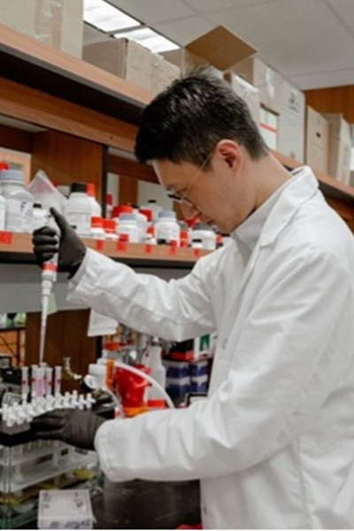
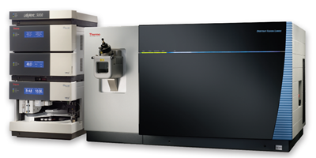

# Understanding Method Development: Your Questions Answered

## What We Do

**Q: What is method development and why would I need it for my dairy products?**

A: Method development is creating entirely new analytical approaches when existing methods don't exist or aren't suitable for your specific needs. Dairy products present unique analytical challenges - high fat content, complex protein matrices, diverse peptide populations, and interfering compounds that can overwhelm standard analytical methods. When you need to analyze novel bioactive compounds, track specific modifications, or work with challenging sample types that existing methods can't handle, we develop custom mass spectrometry approaches tailored specifically to your analytical challenges.

**Q: When do I need custom method development versus standard analysis?**

A: Consider method development when:
- **Your compounds aren't covered by existing methods** - Novel bioactive peptides, new protein modifications, or emerging ingredients
- **Standard methods fail in your matrix** - Complex dairy products that interfere with conventional extraction or analysis
- **You need cutting-edge capabilities** - Advanced techniques like top-down proteomics or glycopeptidomics that require specialized approaches
- **Regulatory requirements demand validated methods** - Custom methods with full validation documentation for regulatory submissions
- **You're pushing analytical boundaries** - Detecting trace compounds, analyzing complex mixtures, or requiring exceptional sensitivity

## Our Method Development Expertise

**Q: What makes your method development capabilities unique?**

**Complex Matrix Expertise:**
- **Dairy-specific challenges** - Deep understanding of how milk proteins, fats, and lactose interfere with analysis
- **Sample preparation mastery** - Advanced techniques to extract target compounds from challenging matrices
- **Matrix effect mitigation** - Strategies to eliminate interferences that plague standard methods

**Advanced MS Techniques:**
- **LC-MS/MS optimization** - Custom chromatography and mass spectrometry parameters for your specific compounds
- **Top-down proteomics** - Intact protein analysis preserving critical modifications
- **Glycopeptidomics** - Specialized methods for analyzing glycosylated peptides and proteins
- **Targeted and untargeted approaches** - Both discovery-based and focused quantitative methods

**Comprehensive Development Process:**
- **Method design** - From initial concept through full analytical workflow
- **Optimization** - Fine-tuning sensitivity, selectivity, and reproducibility
- **Validation** - Complete method validation meeting regulatory standards
- **Technology transfer** - Training and documentation for implementation in your lab

## Service Capabilities

**Q: What specific method development services do you offer?**

**Sample Preparation Development:**
- **Extraction optimization** - Custom protocols for efficient compound recovery from complex matrices
- **Cleanup strategies** - Removing interferences while preserving target analytes
- **Concentration techniques** - Maximizing sensitivity for trace-level analysis
- **Matrix-matched approaches** - Sample prep specifically designed for your product type

**LC-MS/MS Method Development:**
- **Chromatographic optimization** - Custom separation conditions for your specific compounds
- **Mass spectrometry tuning** - Optimized fragmentation and detection parameters
- **Quantitative method development** - Accurate, precise quantification with appropriate internal standards
- **High-throughput adaptations** - Scaling methods for routine analysis needs

**Specialized Techniques:**
- **Top-down proteomics methods** - Intact protein analysis preserving post-translational modifications
- **Glycopeptidomics approaches** - Specialized methods for glycosylated compounds
- **Multi-compound panels** - Simultaneous analysis of multiple bioactive compounds
- **Real-time analysis** - Rapid methods for quality control applications

## Research Applications & Method Innovation

**Q: Can you show me examples of methods you've developed?**

**[Optimizing Sample Preparation for Complex Biological Matrices](https://health.oregonstate.edu/research/publications/103390foods12020299)**
*Qu et al. (2023), Foods*
We systematically compared different solid-phase extraction approaches for monitoring caseinomacropeptide survival during digestion. This work shows how proper sample preparation method development is crucial for accurate analysis in challenging biological matrices.

**[Comprehensive Extraction Method Comparison](https://health.oregonstate.edu/research/publications/101016jfoodchem2022133864)**
*Koh et al. (2022), Food Chemistry*
We developed and compared three different extraction methods for analyzing caseinomacropeptide in feeding materials and biological fluids. This systematic approach demonstrates how method development identifies the optimal extraction strategy for each specific application.

**[Pioneering Top-Down Glycopeptidomics Methods](https://health.oregonstate.edu/research/publications/101093jnnxab400)**
*Koh et al. (2021), The Journal of Nutrition*
We developed cutting-edge top-down glycopeptidomics methods to analyze intact glycomacropeptide and its digestion products in human samples. This represents breakthrough method development for analyzing complex glycosylated peptides that conventional methods cannot handle.

## Implementation & Quality Assurance

**Q: How do you ensure developed methods will work in my laboratory?**

**Method Robustness:**
- **Extensive testing** - Methods tested across multiple conditions and operators
- **Equipment flexibility** - Methods designed to work on standard LC-MS/MS systems
- **Clear documentation** - Detailed protocols minimizing implementation variability
- **Validation studies** - Comprehensive validation ensuring method reliability

**Implementation Support:**
- **Technology transfer** - Hands-on training and method transfer to your laboratory
- **Equipment assessment** - Evaluation of your current analytical capabilities
- **Troubleshooting support** - Ongoing assistance during initial implementation
- **Method adaptation** - Adjustments for your specific equipment or sample types

## Deliverables

**Q: What will I receive from a method development project?**

- **Complete analytical method** - Detailed protocols from sample preparation through data analysis
- **Method validation data** - Accuracy, precision, sensitivity, and selectivity documentation
- **Troubleshooting guide** - Common issues and solutions for robust implementation
- **Standard operating procedures** - Ready-to-implement protocols for your laboratory
- **Training materials** - Documentation and training for your analytical staff
- **Technical reports** - Comprehensive documentation suitable for regulatory submissions
- **Ongoing support** - Consultation during initial implementation and optimization

---

*For detailed service descriptions, project scope options, and custom development quotes, please visit our **[Services & Pricing Page](services_pricing_page.md)** or **[Getting Started Guide](getting_started_page.md)** to assess your method development needs.*

## Service Images

