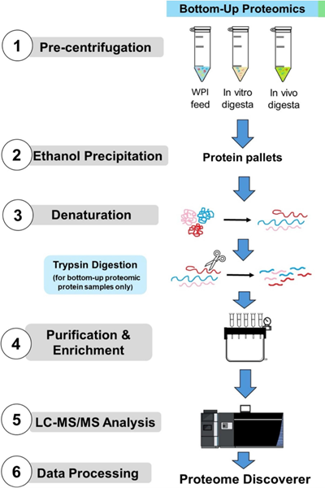
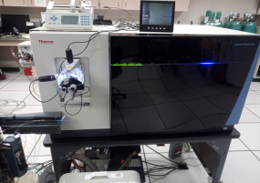
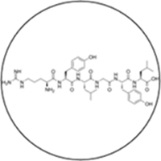

# Understanding Peptidomics & Proteomics: Your Questions Answered

## What We Do

**Q: What exactly are peptidomics and proteomics, and why should I care about them for my dairy products?**

A: Think of proteins as the workhorses of milk - they provide nutrition, structure, and biological activity. Proteomics is the comprehensive study of all proteins in your sample, telling you what proteins are present, how much of each, and how they've been modified. Peptidomics focuses on the smaller pieces - peptides that form when proteins break down during processing, digestion, or storage. These peptides often have powerful bioactive properties that can enhance health benefits, improve functionality, or serve as quality markers for your products.

**Q: How can this analysis help my business?**

A: Our analysis can help you:
- **Optimize processing conditions** - See exactly how heat treatment, fermentation, or other processes affect your protein content
- **Discover bioactive compounds** - Identify peptides with health benefits like antioxidant, antimicrobial, or blood pressure-lowering properties
- **Improve quality control** - Develop protein-based markers to ensure consistent product quality
- **Support health claims** - Generate scientific data to back up nutritional and functional claims
- **Innovate new products** - Understand which processing conditions create the most beneficial peptides

## Our Analytical Capabilities

**Q: What makes your analysis different from standard protein testing?**

A: Traditional protein testing might tell you total protein content, but we provide the complete molecular story. Using advanced mass spectrometry, we can:
- Identify individual proteins down to their exact molecular structure
- Quantify specific proteins and peptides with high precision
- Track how proteins change during processing or storage
- Discover new bioactive peptides unique to your products
- Analyze post-translational modifications that affect protein function

## Service Offerings

**Q: What specific services do you offer?**

**For Protein Analysis (Proteomics):**
- **Bottom-up proteomics** - Comprehensive protein identification and quantification
- **Top-down proteomics** - Analysis of intact proteins to preserve modifications
- **Label-free and TMT-labeled quantification** - Precise protein comparisons between samples
- **Targeted analysis (MRM/PRM)** - Focused analysis of specific proteins of interest
- **Post-translational modification analysis** - Phosphorylation, glycosylation, and other modifications
- **Traditional methods** - ELISA and HPLC for quantitative protein determination, SDS-PAGE and Gel-electrophoresis for protein separation and analysis
- **Free amino acid analysis** - Comprehensive amino acid profiling using HPLC-DAD or HPLC-MS

**For Peptide Analysis (Peptidomics):**
- **Comprehensive peptide profiling** - Complete peptide inventory using LC-MS/MS
- **Bioactive peptide discovery** - Identification of health-promoting peptides
- **Functional annotation** - Prediction of biological activities
- **Absorptomics** - Analysis of which peptides can be absorbed into blood
- **Digestion studies** - Track peptide formation during digestion processes

## Technology & Equipment

**Q: What technology do you use?**

A: We use the **Orbitrap Fusion Lumos**, one of the most advanced mass spectrometers available:
- **Ultra-high resolution** (up to 500,000 at m/z 200) for precise molecular identification
- **Multiple fragmentation methods** (HCD, CID, ETD) to fully characterize peptides and proteins
- **Exceptional sensitivity** - can detect proteins/peptides at attomole levels
- **Real-time search capabilities** - immediate identification during analysis
- **Advanced data acquisition modes** for comprehensive coverage

This technology allows us to provide deeper insights than standard analytical methods, identifying and quantifying thousands of proteins and peptides in a single analysis.

## Research Applications & Real-World Solutions

**Q: Can you show me examples of your recent work and how it applies to industry challenges?**

**[Understanding Lactoferrin Digestion for Better Infant Nutrition](https://health.oregonstate.edu/research/publications/103390nu16142360)**
*Kim et al. (2024), Nutrients*
We compared how human milk lactoferrin, recombinant human lactoferrin, and bovine lactoferrin behave during digestion. This study helps infant formula companies understand which lactoferrin sources provide optimal bioactive peptide release.

**[Solving Bitter Taste Problems in Aged Cheese](https://health.oregonstate.edu/research/publications/10.1016/j.foodchem.2023.138111)**
*Kuhfeld et al. (2023), Food Chemistry*
We identified exactly which peptides cause bitter taste in aged cheddar cheese using advanced fractionation and peptidomics combined with sensory analysis. This research helps cheese makers understand and control bitterness during aging.

**[Optimizing Whey Protein Functionality](https://health.oregonstate.edu/research/publications/103390foods10092028)**
*Qu et al. (2021), Foods*
We developed advanced methods to analyze glycomacropeptide from kappa-casein, a valuable bioactive component in whey. This research helps companies optimize whey processing to preserve and enhance beneficial compounds.

**[Whey Protein Survival During Digestion](https://health.oregonstate.edu/research/publications/101016jfoodchem2024142013)**
*Sutantawong et al. (2024), Food Chemistry*
We tracked which whey proteins survive digestion intact in real humans versus laboratory models. This research helps companies design products where proteins need to reach specific parts of the digestive system intact.

**[Maximizing Bioactive Peptide Release from Whey](https://health.oregonstate.edu/research/publications/101016jjff2024106540)**
*Sutantawong et al. (2024), Journal of Functional Foods*
We mapped exactly which bioactive peptides are released when whey proteins are digested by humans. This research guides product developers in optimizing processing conditions to maximize health-promoting peptide formation.

## Sample Requirements & Deliverables

**Q: What do you need from me to get started?**

We work with various sample types:
- **Liquid samples** - Milk, whey, beverages (as little as 1-5 mL)
- **Powder samples** - Protein powders, infant formula (1-5 grams)
- **Processed products** - Cheese, yogurt, fermented products
- **Digesta samples** - For studying protein breakdown during digestion

**Q: What will I receive from your analysis?**

- Comprehensive data report with protein/peptide identifications and quantifications
- Statistical analysis and data visualization
- Biological interpretation and functional annotations for bioactive peptides
- Technical reports formatted for regulatory submissions or internal use
- Raw data files for your records
- Consultation call to discuss results and next steps
- Scientific publication opportunities through collaborative research partnerships

## Applications & Project Types

**Q: What types of projects do you typically work on?**

**Common applications include:**
- **Processing optimization** - Understanding how different pasteurization, fermentation, or drying conditions affect protein quality
- **Bioactive peptide discovery** - Identifying peptides with health benefits in dairy products
- **Quality control development** - Creating protein-based markers for consistent production
- **Regulatory support** - Generating data to support health claims or novel food applications
- **Competitive analysis** - Understanding what makes your products unique at the molecular level
- **Troubleshooting** - Solving problems related to protein functionality, stability, or quality

---

*For detailed service descriptions, current pricing, and package options, please visit our **[Services & Pricing Page](services_pricing_page.md)** or **[Getting Started Guide](getting_started_page.md)** or **[Q&A Page](qa_pages.md)** to explore how advanced protein and peptide analysis can benefit your business.*

## Service Images

