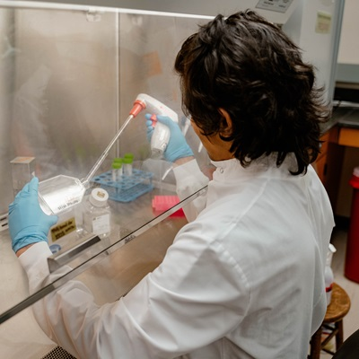
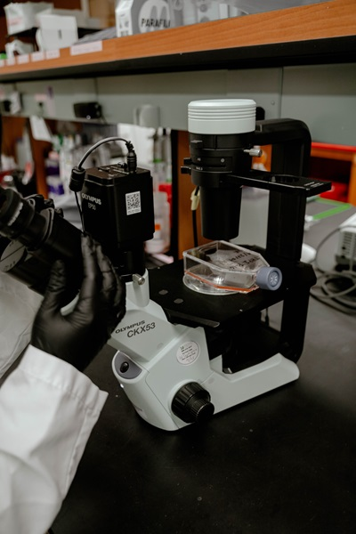

# Understanding Functional Analysis: Your Questions Answered

## What We Do

**Q: What is functional analysis and why is it important for my dairy products?**

A: Functional analysis goes beyond identifying what's in your product - it tests whether those components actually work. While analytical chemistry tells you what peptides, proteins, or bioactive compounds are present, functional analysis proves whether they deliver the health benefits you're claiming. Think of it as the bridge between "we found this compound" and "this compound actually improves health." For dairy companies, this is crucial for developing evidence-based health claims, optimizing processing conditions, and creating products with verified biological activity.

**Q: How can functional testing benefit my business?**

A: Functional analysis can help you:
- **Support health claims** - Generate scientific evidence that your bioactive compounds actually work
- **Optimize product formulations** - Determine which processing conditions preserve or enhance biological activity
- **Validate ingredient sourcing** - Confirm that different suppliers' ingredients provide consistent bioactivity
- **Develop competitive advantages** - Prove that your products deliver superior functional benefits
- **Guide product development** - Identify which compounds to focus on for maximum health impact
- **Meet regulatory requirements** - Provide evidence needed for functional food approvals

## Our Testing Capabilities

**Q: What types of biological activities can you test?**

**Immune System Effects:**
- **THP-1 macrophage assays** - Test how compounds affect immune cell behavior and inflammatory responses
- **Immunomodulatory testing** - Measure whether compounds enhance or regulate immune function

**Digestive Health & Absorption:**
- **Cell adhesion assays** - Evaluate how compounds interact with intestinal cells
- **Bioavailability testing** - Determine which compounds can actually be absorbed into the body
- **Caco-2 cell monolayers** - Model intestinal absorption to predict real-world bioavailability

**Enzyme Activity & Metabolism:**
- **BSSL (bile salt-stimulated lipase) assays** - Critical for fat digestion in infants
- **Lipase and protease activity** - Essential for protein and fat breakdown
- **Lysozyme activity** - Important antimicrobial enzyme testing
- **Metabolic pathway analysis** - Understanding how compounds affect cellular metabolism

**Oxidative Stress & Stability:**
- **Lipid oxidation testing** - Measure antioxidant capacity and product stability
- **Fatty acid profiling** - Comprehensive analysis of fatty acid composition and quality

**Digestive Function:**
- **Fecal fat and protein analysis** - Assess digestive efficiency and nutrient absorption

## Research Applications & Proven Results

**Q: Can you show me examples of how functional testing has solved real problems?**

**[Proving Milk Peptides Actually Get Absorbed](link-to-paper)**
*Liang et al. (2022), Journal of Agricultural and Food Chemistry*
We used Caco-2 cell models to prove that specific peptides from digested human milk can actually cross the intestinal barrier and enter the bloodstream. This research helps infant formula companies understand which processing conditions create peptides that babies can actually absorb and benefit from.

**[Demonstrating Real Immune Benefits](link-to-paper)**
*Liang et al. (2021), The Journal of Nutrition*
We showed that peptides from human milk digestion actually modulate immune cell behavior in THP-1 macrophages, proving these compounds have genuine immunomodulatory effects. This type of evidence is essential for companies developing immune-supporting dairy products and seeking to make science-backed health claims.

## Sample Requirements & Testing Process

**Q: What do you need from me to test my compounds?**

We can work with various sample types:
- **Purified compounds** - Individual peptides, proteins, or other bioactive molecules
- **Product extracts** - Concentrated bioactive fractions from your products
- **Whole products** - Complete formulations for comprehensive activity assessment
- **Process samples** - Materials from different processing stages to optimize bioactivity retention

Sample requirements vary by assay type, but we typically work with small quantities (milligrams to grams) and can accommodate special handling requirements.

**Q: I have compounds identified through analysis - how do I know which functional tests to run?**

Based on your compounds' structures, known activities, and intended applications, we'll recommend the most relevant bioactivity assays. For example:
- **Antimicrobial peptides** → lysozyme activity and microbial inhibition assays
- **Immune-active compounds** → THP-1 macrophage and immunomodulatory testing
- **Digestive enzymes** → specific enzyme activity assays
- **Bioactive peptides** → absorption studies and target-specific functional assays

We can also design custom assays if standard tests don't match your specific research questions.

## Project Applications

**Q: What types of functional testing projects do you typically work on?**

**Common applications include:**
- **Health claim validation** - Proving that bioactive compounds in your products actually deliver claimed benefits
- **Processing optimization** - Testing how different manufacturing conditions affect bioactivity retention
- **Ingredient comparison** - Evaluating bioactivity differences between suppliers or processing methods
- **Product development** - Screening potential bioactive ingredients for new product formulations
- **Quality control** - Developing functional assays as bioactivity markers for batch-to-batch consistency
- **Regulatory support** - Generating functional evidence required for novel food or health claim approvals
- **Competitive analysis** - Demonstrating superior bioactivity compared to existing products

## Deliverables

**Q: What will I receive from functional testing?**

- Comprehensive bioactivity reports with statistical analysis and dose-response curves
- Comparative analysis against reference standards or control samples
- Mechanistic insights into how your compounds work
- Technical reports formatted for regulatory submissions
- Scientific publications through collaborative research partnerships
- Recommendations for optimizing bioactivity in your products
- Raw data files and detailed methodology
- Consultation to interpret results and plan next steps

## Service Integration

**Q: How does functional testing complement analytical analysis?**

Analytical and functional testing are perfect partners. Analytical analysis (proteomics/peptidomics) identifies and quantifies what's in your product, while functional testing proves those compounds actually work. Together, they provide complete evidence for product development and health claims:

1. **Discovery** - Analytical analysis identifies potential bioactive compounds
2. **Validation** - Functional testing proves these compounds have biological activity
3. **Optimization** - Both techniques guide processing improvements to maximize beneficial compounds and their activity
4. **Quality control** - Combined approaches ensure consistent composition and bioactivity

This integrated approach provides the strongest possible evidence for product efficacy and regulatory approval.

---

*For detailed assay descriptions, current pricing, and custom testing options, please visit our **[Services & Pricing Page](services_pricing_page.md)** or **[Getting Started Guide](getting_started_page.md)** to design the perfect functional testing strategy for your compounds and goals.*

## Service Images

